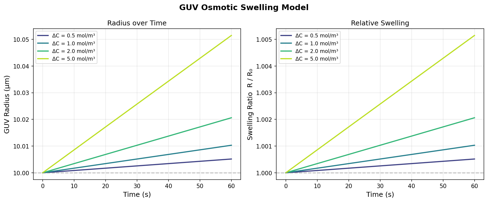
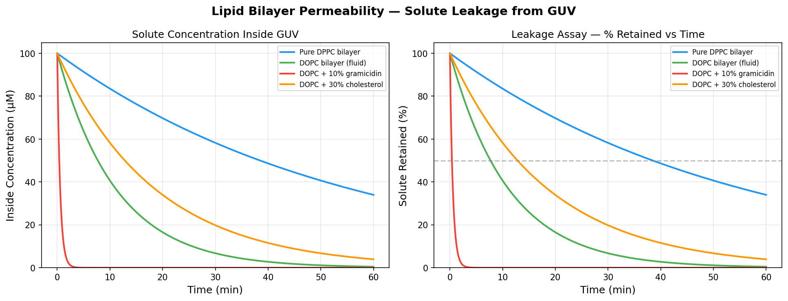
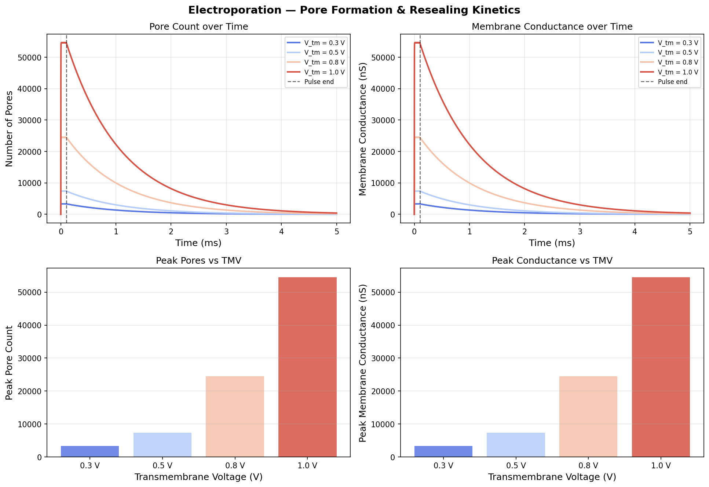
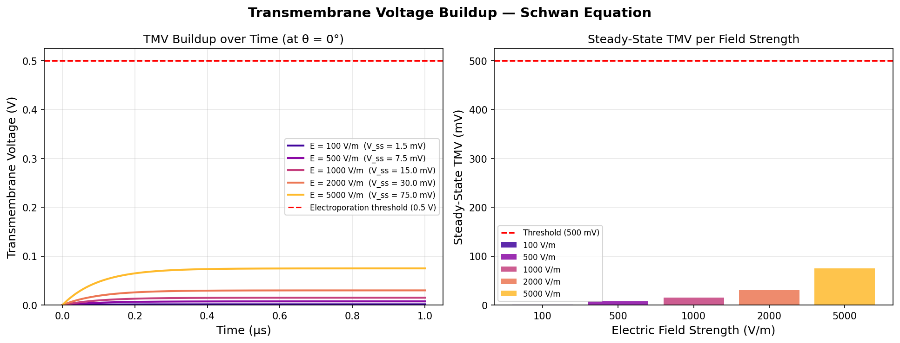
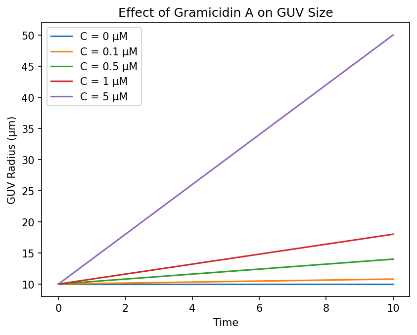
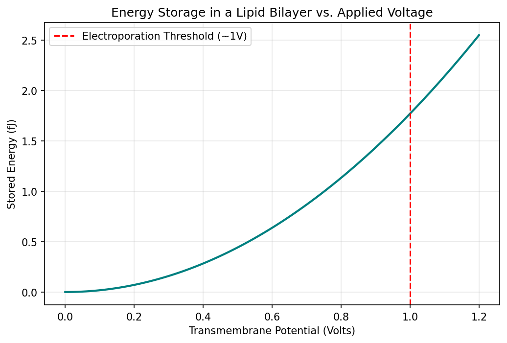

# Membrane Biophysics Models

Python simulations for GUV osmotic swelling, bilayer permeability, electroporation pore kinetics, and transmembrane voltage dynamics. These models complement my experimental work on giant unilamellar vesicles (GUVs) at the Biophysics Laboratory, BUET, where I study how Gramicidin A ion channels and green-synthesized magnetite nanoparticles drive membrane deformation and poration.

## Repository Contents

| Script | Physics | Key Equations | Output |
|--------|---------|---------------|--------|
| `guv_osmotic_swelling.py` | Osmotic swelling of GUVs in hypotonic solution | Van't Hoff osmotic pressure, membrane water permeability (Lp) | `guv_osmotic_swelling.png` |
| `bilayer_permeability.py` | Passive solute diffusion across lipid bilayer | Fick's first law, first-order leakage kinetics | `bilayer_permeability.png` |
| `electroporation_pore_kinetics.py` | Electropore formation and resealing dynamics | Weaver-Chizmadzhev two-phase pore kinetics model | `electroporation_pore_kinetics.png` |
| `transmembrane_voltage_schwan.py` | Transmembrane voltage buildup under external field | Schwan equation, RC membrane charging model | `transmembrane_voltage_schwan.png` |
| `guv_gramicidin_model.py` | Gramicidin A concentration effect on GUV size | Linear concentration-radius model | `guv_gramicidin_model.png` |
| `membrane_capacitor_model.py` | Energy storage in lipid bilayer as capacitor | Parallel-plate capacitance, E = ½CV² | `membrane_capacitor_model.png` |

---

## 1. GUV Osmotic Swelling Model

`guv_osmotic_swelling.py`

Models how GUVs swell over time when placed in a hypotonic solution, based on osmotic pressure and membrane water permeability.

**Key equation:**
dR/dt = Lp · R₀ · Δπ / (3R)

where Δπ = RT · ΔC is the Van't Hoff osmotic pressure difference, Lp is the bilayer water permeability coefficient, and R₀ is the initial vesicle radius.

**Parameters:**
- Initial GUV radius: 10 µm
- Membrane water permeability (Lp): 2 × 10⁻¹³ m/(Pa·s) (DOPC typical)
- Temperature: 310.15 K (37°C)
- Osmotic concentration differences: 0.5, 1.0, 2.0, 5.0 mol/m³

**Method:** ODE integration via `scipy.integrate.solve_ivp` (RK45).

*Left: GUV radius vs time for different osmotic gradients. Right: Swelling ratio R/R₀ showing relative deformation.*

---

## 2. Lipid Bilayer Permeability — Fick's Law Simulator

`bilayer_permeability.py`

Simulates passive diffusion of a solute (e.g., fluorescent dye, small molecule drug) across a lipid bilayer membrane. Directly relevant to fluorescence leakage assays (calcein, ANTS/DPX) and drug encapsulation efficiency in liposomes.

**Key equations:**
J = -P · (C_in - C_out) (Fick's first law) dC_in/dt = -(A/V) · P · (C_in - C_out)

where P is the permeability coefficient, A is the membrane surface area, and V is the vesicle volume.

**Conditions compared:**
- Pure DPPC bilayer (gel phase, tight): P = 1 × 10⁻⁹ m/s
- DOPC bilayer (fluid phase): P = 5 × 10⁻⁹ m/s
- DOPC + 10% Gramicidin (ion channel pores): P = 1 × 10⁻⁷ m/s
- DOPC + 30% cholesterol (ordered phase): P = 3 × 10⁻⁹ m/s

**Method:** ODE integration via `scipy.integrate.solve_ivp` (RK45). Analytical half-life: t½ = ln(2) / (P · A/V).

*Left: Solute concentration inside GUV vs time. Right: Percentage retained (leakage assay format). Note the dramatic increase in permeability with Gramicidin A incorporation.*

---

## 3. Electroporation Pore Formation & Resealing Kinetics

`electroporation_pore_kinetics.py`

Models how electropores open during an electric pulse and reseal after the field is removed, using the Weaver-Chizmadzhev two-phase kinetic model.

**Key equations:**
Phase 1 (pore opening, during pulse): dN/dt = α · exp(V_tm / V₀) - N / τ_open

Phase 2 (resealing, after pulse): dN/dt = -N / τ_reseal

Membrane conductance: G_pore(t) = N(t) · g_single

where N is the number of pores, α is the pore creation rate, V_tm is the transmembrane voltage, V₀ is the characteristic voltage, τ_open and τ_reseal are the pore lifetime and resealing time constants, and g_single is the conductance of a single pore (~1 nS).

**Parameters:**
- Pulse duration: 100 µs
- Resealing time constant: 1 ms
- Single pore conductance: 1 nS
- Transmembrane voltages: 0.2, 0.4, 0.6, 0.8, 1.0 V

**Reference:** Weaver & Chizmadzhev (1996), *Bioelectrochemistry and Bioenergetics*.

**Method:** Two-stage ODE integration via `scipy.integrate.solve_ivp` (RK45), with pore count and membrane conductance tracked across both phases.

*Top-left: Pore count vs time showing rapid opening during pulse and exponential resealing after. Top-right: Membrane conductance dynamics. Bottom: Peak pore count and peak conductance as functions of transmembrane voltage.*

---

## 4. Transmembrane Voltage — Schwan Equation

`transmembrane_voltage_schwan.py`

Models the buildup of transmembrane voltage (TMV) when an external electric field is applied to a spherical GUV or cell, using the Schwan equation and an RC charging model.

**Key equations:**
Steady-state: V_tm = 1.5 · R · E · cos(θ) Time-dependent: V_tm(t) = 1.5 · R · E · cos(θ) · (1 - exp(-t / τ)) Charging time: τ = R · C_m / (2 · σ_i)

where R is the vesicle radius, E is the external field, θ is the polar angle, C_m is the specific membrane capacitance, and σ_i is the intracellular conductivity.

**Parameters:**
- GUV radius: 10 µm
- Membrane capacitance: 1 × 10⁻² F/m² (~1 µF/cm²)
- Intracellular conductivity: 0.5 S/m
- Electric field strengths: 100, 500, 1000, 2000, 5000 V/m
- Electroporation threshold: 0.5 V

**Reference:** Schwan, H.P. (1957), *Electrical properties of tissue and cell suspensions*.

*Left: TMV buildup over time at the field-facing pole (θ = 0°) for different field strengths. Right: Steady-state TMV per field strength, with electroporation threshold marked.*

---

## 5. Gramicidin A Effect on GUV Size

`guv_gramicidin_model.py`

A simplified model showing how Gramicidin A concentration affects GUV radius over time, representing the concentration-dependent membrane remodeling observed in my experiments.

**Model:**
R(t) = R₀ + k · C · t

where R₀ is the initial radius, C is the Gramicidin A concentration, and k is a rate constant capturing the peptide-induced membrane expansion.

**Concentrations tested:** 0, 0.1, 0.5, 1, 5 µM.

*GUV radius vs time for different Gramicidin A concentrations, showing concentration-dependent membrane expansion.*

---

## 6. Membrane Capacitor Model

`membrane_capacitor_model.py`

Calculates the energy stored in a lipid bilayer treated as a parallel-plate capacitor, relevant to understanding the energetic threshold for electroporation.

**Key equations:**
C = ε₀ · εᵣ · A / d (parallel-plate capacitance) E = ½ · C · V² (stored energy)

**Parameters:**
- Membrane thickness: 5 nm
- Membrane area: 1 µm²
- Relative permittivity: 2.0 (lipid tail region)
- Voltage range: 0 – 1.2 V (electroporation threshold ~1 V)

*Energy stored in a lipid bilayer vs applied transmembrane voltage, with electroporation threshold marked.*

---

## Dependencies

- Python 3.x
- NumPy
- SciPy
- Matplotlib
pip install numpy scipy matplotlib

## Author

**Tamanna Mostafa Snigdha**
M.S. Student (Biophysics), Department of Physics
Bangladesh University of Engineering and Technology (BUET)

GitHub: [TamannaMS](https://github.com/TamannaMS)

